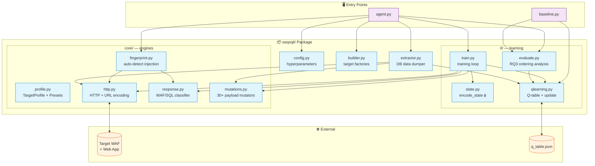
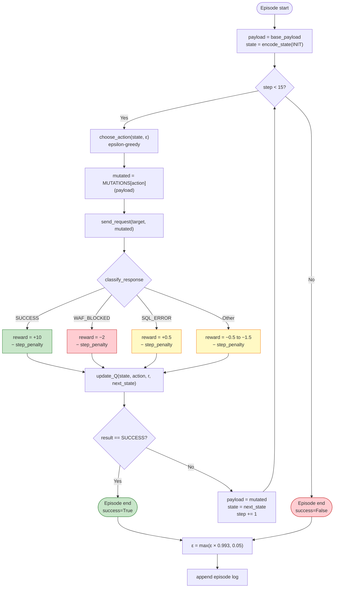
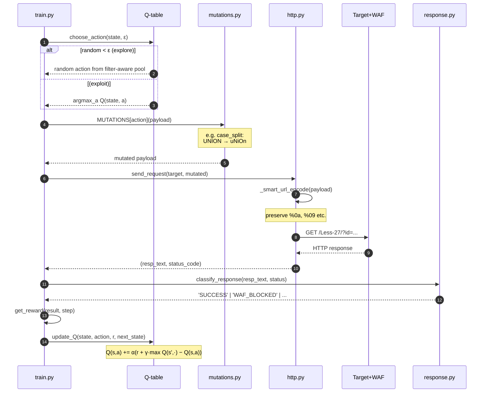

# SeqSQLi

> **Sequential SQL Injection Agent with Reinforcement Learning**
> Adaptive WAF bypass via Q-learning over a sequential mutation policy.

[](https://www.python.org/)
[]()
[]()

🌐 **Language:** [English](README.md) | **Bahasa Indonesia**

---

## 📚 Daftar Isi

- [Mengapa Tool Ini Dibutuhkan?](#-mengapa-tool-ini-dibutuhkan)
- [Pendekatan](#-pendekatan)
- [Arsitektur Sistem](#-arsitektur-sistem)
- [Alur Training (RL Episode)](#-alur-training-rl-episode)
- [Sequence Diagram: Satu Step](#-sequence-diagram--satu-step)
- [Struktur Project](#-struktur-project)
- [Instalasi](#-instalasi)
- [Cara Pakai](#-cara-pakai)
- [Research Questions](#-research-questions)
- [Output Files](#-output-files)
- [Konsep RL untuk Pemula](#-konsep-rl-untuk-pemula)
- [Disclaimer](#-disclaimer)

---

## Mengapa Tool Ini Dibutuhkan?

Modern **Web Application Firewall (WAF)** memblokir SQL injection menggunakan
*signature-based blacklist*, daftar kata kunci seperti `UNION`, `SELECT`,
spasi, dan komentar. Untuk menembusnya, penetration tester perlu **memutasi**
payload (mengganti spasi dengan `%0a`, mencampur huruf besar-kecil,
memecah keyword, dll). Tetapi pendekatan klasik punya tiga keterbatasan:

| Pendekatan Klasik | Masalah |
|---|---|
| **Manual trial-and-error** | Lambat, melelahkan, tidak scalable |
| **Static evasion list** (sqlmap tamper) | Vendor WAF cepat patch, pakai urutan tetap |
| **Brute-force mutator** | Ribuan request, mudah terdeteksi rate limiting |

**Key Insight**: untuk filter berlapis, satu mutasi saja tidak cukup
yang dibutuhkan adalah **urutan** mutasi yang tepat. Misalnya untuk
sqli-labs Less-27, urutan `case_split → vtab` (2 langkah) menghasilkan
payload yang lolos, sedangkan urutan terbalik `vtab → case_split` gagal.

SeqSQLi memodelkan masalah ini sebagai **Sequential Decision Problem**
dan menyelesaikannya dengan **Q-learning**, agent belajar urutan mutasi
yang efektif dari pengalaman, dengan jumlah request seminimal mungkin.

---

## Approach

Masalah dirumuskan sebagai **Markov Decision Process (MDP)**:

| Komponen MDP | Implementasi |
|---|---|
| **State** `s` | Hasil response terakhir + last action + step + 14-bit payload feature |
| **Action** `a` | 30+ jenis mutasi (case, comment, encoding, splitting, dll) |
| **Reward** `r` | +10 sukses, +0.5 SQL error, −2 WAF block, −0.08 step penalty |
| **Policy** `π(a\|s)` | Epsilon-greedy dengan filter-aware exploration bias |

Agent dilatih selama N episode (default 300). Setiap episode dimulai dengan
payload basis (mis. `0' UNION SELECT 1,2,'3`) dan agent memilih mutasi
sampai payload bisa lolos WAF, atau mencapai batas 15 langkah.

**Inovasi vs SSQLi (paper acuan)**:

1. **State-aware mutation**, payload feature vector membantu agent ingat
   mutasi apa yang sudah dia coba (history implisit).
2. **Filter-aware exploration**, exploration acak di-bias ke mutasi yang
   relevan dengan filter type yang terdeteksi.
3. **Step penalty**, reward function mendorong policy yang efisien
   (sedikit langkah, sedikit request).

---

## Arsitektur Sistem



---

## Alur Training (RL Episode)

Diagram di bawah menggambarkan satu episode lengkap:



---

## Sequence Diagram (Single step)

Apa yang terjadi di balik layar saat agent membuat satu keputusan:



---

## 📁 Struktur Project

```
seqsqli-v2/
├── agent.py                 # Entry point — CLI orchestration only (~190 lines)
├── baseline.py              # Comparison: random, static, heuristic vs RL
├── README.md                # English version
├── README.id.md             # ← kamu di sini (Bahasa Indonesia)
│
└── seqsqli/                 # Main package
    ├── __init__.py
    ├── config.py            # All hyperparameters in one place
    ├── builder.py           # TargetProfile factories + legacy compat
    ├── extractor.py         # DataExtractor — dump DB after bypass
    │
    ├── core/                # Domain logic (no RL)
    │   ├── profile.py       # TargetProfile dataclass + sqli-labs presets
    │   ├── http.py          # Smart URL encoding + session
    │   ├── response.py      # classify_response (WAF/SUCCESS/ERROR)
    │   ├── fingerprint.py   # Auto-detect quote, columns, filter type
    │   └── mutations.py     # 30+ payload mutators + filter-aware hints
    │
    └── rl/                  # Reinforcement learning
        ├── state.py         # encode_state — ϕ(p_t, h_t)
        ├── qlearning.py     # Q-table, choose_action, update_Q, save/load
        ├── train.py         # Training episode loop
        └── evaluate.py      # evaluate + analyze_q_table + analyze_ordering
```

**Filosofi separation of concerns:**

- **`core/`**, pure domain logic, tidak tahu apa-apa tentang RL.
- **`rl/`**, RL components, tidak tahu detail HTTP atau mutasi.
- **`agent.py`**, orchestrator, tidak ada bisnis logic sama sekali.

Mau ubah hyperparameter? Edit `config.py`. Mau tambah preset baru? Edit
`core/profile.py`. Mau tambah mutasi baru? Edit `core/mutations.py`.
Setiap perubahan terlokalisasi di satu file.

---

## Instalasi

**Prasyarat**: Python 3.9+, sqli-labs lab (lokal atau remote).

```bash
# Clone repo
git clone git@github.com:robyfirnandoyusuf/SeqSQLi.git seqsqli
cd seqsqli

# Install dependency (cuma satu)
pip3 install requests

# (Opsional) Verify package
python3 -c "from seqsqli.config import EPSILON; print(f'OK, ε={EPSILON}')"
```

---

## Usage

### 1. Training agent

```bash
# Auto-fingerprint + train (recommended for new targets)
python3 agent.py --less 27 --episodes 300

# Skip fingerprinting (use preset; faster, deterministic)
python3 agent.py --less 27 --episodes 300 --no-fingerprint

# Custom URL
python3 agent.py --url "http://target/vuln.php" --param id --episodes 300
```

Output:
- `q_table.json`, learned Q-values (reusable across runs)
- `results_less27.json`, per-episode logs
- `ordering_less27.json`, RQ3 ordering analysis

### 2. Baseline comparison (jalankan setelah training)

```bash
python baseline.py --less 27 --episodes 50 --no-fingerprint
```

Membandingkan **5 metode**: Random, Static Round-Robin, Single Heuristic,
Filter-Aware (~SSQLi), dan RL Agent. Output: `comparison_less27.json` +
`ordering_baseline_less27.json`.

### 3. Data extraction (post-bypass)

```bash
# Train + extract DB content
python3 agent.py --less 27 --episodes 300 --extract

# Use existing Q-table to extract without re-training
python3 agent.py --less 27 --extract --load --eval-only
```

### 4. Useful flags

| Flag | Fungsi |
|---|---|
| `--episodes N` | Jumlah training episode (default: 300) |
| `--load` | Load Q-table sebelumnya (untuk continual learning) |
| `--eval-only` | Skip training, jalankan greedy policy |
| `--fingerprint` | Hanya fingerprinting, lalu exit |
| `--no-fingerprint` | Skip auto-detection, langsung pakai preset |
| `--extract` | Dump DB setelah bypass berhasil |
| `--all` | Train pada semua preset (Less-1 sampai Less-36) |

---

## Research Questions

| RQ | Pertanyaan | Dijawab oleh |
|---|---|---|
| **RQ1** | Apakah RL bisa belajar strategi WAF bypass? | `agent.py` → kurva success rate naik dari ~0% (Ep 1) ke ~100% (Ep 200) |
| **RQ2** | Apakah RL lebih efisien dari pendekatan statis? | `baseline.py` → RL vs Random/Static/Heuristic |
| **RQ3** | Apakah **urutan** mutasi mempengaruhi keberhasilan? | `analyze_ordering()` → 4 analisis (first-step, bigram, reversed-pair, position sensitivity) |

Untuk RQ3 secara khusus, lihat `ordering_less27.json`, analisis
**reversed-pair comparison** (`A→B` vs `B→A`) adalah bukti utama.

---

## Output Files

| File | Isi | Dibaca untuk |
|---|---|---|
| `q_table.json` | Pasangan (state, action) → Q-value | Reuse policy, continual learning |
| `results_less{N}.json` | Per-episode: sequence, reward, success | Plot learning curve |
| `ordering_less{N}.json` | 4 analisis ordering (RQ3) | Tabel di paper |
| `comparison_less{N}.json` | Performance 5 baseline methods | RQ2, chart perbandingan |
| `ordering_baseline_less{N}.json` | Ordering analysis pada greedy RL agent | Cross-validate RQ3 |
| `extract_less{N}.json` | Database dump (jika `--extract`) | Bukti end-to-end exploit |

---

## Konsep RL untuk Pemula

Kalau kamu baru di RL, ini istilah-istilah yang dipakai di kode/output:

- **Episode**: satu sesi mencoba bypass dari awal sampai sukses/gagal.
- **Step**: satu mutasi dalam episode (max 15).
- **Epsilon (ε)**: probabilitas memilih aksi random vs greedy.
  - Awal: ε=0.4 (banyak explore), akhir: ε=0.05 (mostly exploit).
- **Q-value `Q(s,a)`**: estimasi return jika di state `s` pilih aksi `a`.
- **Reward**: feedback numerik tiap step (+10 sukses, −2 diblokir, dll).
- **SR (Success Rate)**: % episode yang berhasil bypass.
- **Convergence**: titik di mana SR stabil tinggi (biasanya ep 150-200).

**Membaca output training**:

```
Ep  200 | eps=0.098 | SR=100% | Steps=2.0 | R=7.76
   ↑           ↑          ↑          ↑         ↑
   episode  exploration  success   avg steps  avg reward
            rate
```

---

## ⚠️ Disclaimer

Tool ini dibuat untuk **penelitian akademik** dan **authorized penetration
testing**. Penggunaan terhadap sistem tanpa izin eksplisit adalah ilegal
dan melanggar etika riset. Penulis tidak bertanggung jawab atas
penyalahgunaan.

Test environment yang direkomendasikan:
- [sqli-labs](https://github.com/Audi-1/sqli-labs) (lokal Docker)
- [DVWA](https://github.com/digininja/DVWA)
- Lab terisolasi seperti `lab.0xffsec.co/Less-XX/` (untuk pembelajaran)

---

**Inspired by:**
- SSQLi: Sequential SQL Injection (referensi utama)
- Q-learning: Watkins & Dayan (1992)
- sqli-labs: Audi-1 (https://github.com/Audi-1/sqli-labs)
