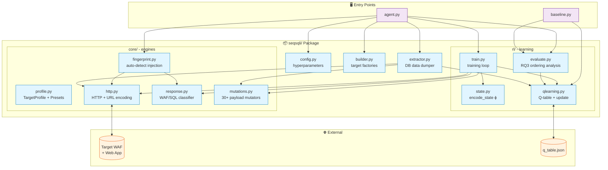
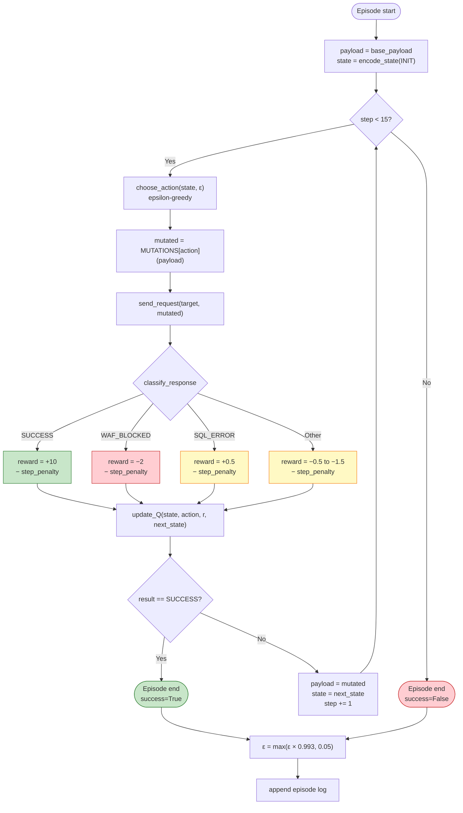
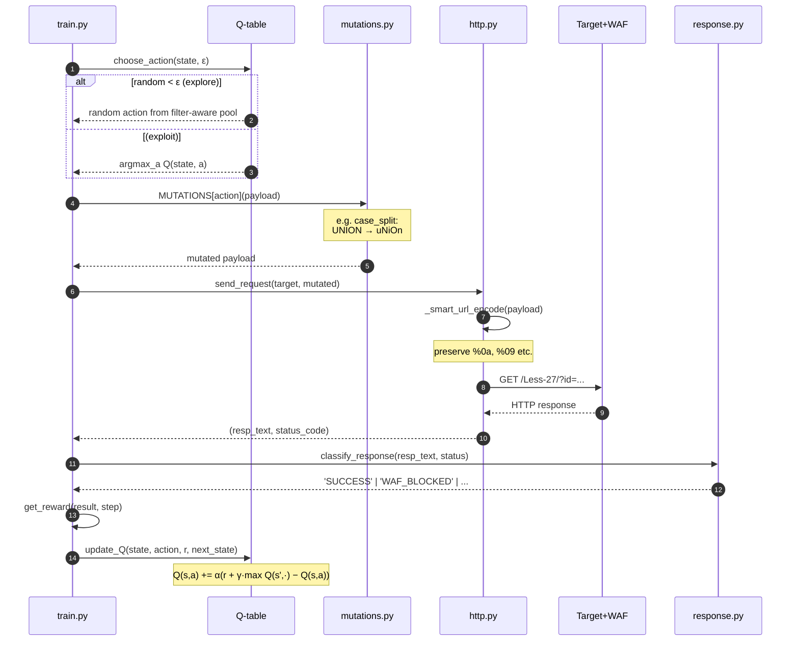

# SeqSQLi

> **Sequential SQL Injection Agent with Reinforcement Learning**
> Adaptive WAF bypass via Q-learning over a sequential mutation policy.

[](https://www.python.org/)
[]()
[]()

🌐 **Language:** **English** | [Bahasa Indonesia](README.id.md)

---

## 📚 Table of Contents

- [Why This Tool Exists](#-why-this-tool-exists)
- [Approach](#-approach)
- [System Architecture](#-system-architecture)
- [Training Flow (RL Episode)](#-training-flow-rl-episode)
- [Sequence Diagram: Single Step](#-sequence-diagram--single-step)
- [Project Structure](#-project-structure)
- [Installation](#-installation)
- [Usage](#-usage)
- [Research Questions](#-research-questions)
- [Output Files](#-output-files)
- [RL Concepts for Beginners](#-rl-concepts-for-beginners)
- [Disclaimer](#-disclaimer)

---

## Why This Tool Exists

Modern **Web Application Firewalls (WAF)** block SQL injection using
*signature-based blacklists*, keyword lists like `UNION`, `SELECT`, spaces,
and comments. To bypass them, penetration testers must **mutate** payloads
(replacing spaces with `%0a`, mixed casing, keyword splitting, etc.). But
classical approaches have three limitations:

| Classical Approach | Problem |
|---|---|
| **Manual trial-and-error** | Slow, exhausting, doesn't scale |
| **Static evasion lists** (sqlmap tamper) | WAF vendors patch these quickly |
| **Brute-force mutators** | Thousands of requests, easily detected by rate-limiting |

**Key insight**: for layered filters, a single mutation isn't enough, what's
needed is the right **sequence** of mutations. For example, on sqli-labs
Less-27, the sequence `case_split → vtab` (2 steps) produces a payload that
slips through, while the reversed order `vtab → case_split` fails.

SeqSQLi models this as a **Sequential Decision Problem** and solves it with
**Q-learning**, the agent learns effective mutation sequences from
experience, with the minimum possible request count.

---

## Approach

The problem is formulated as a **Markov Decision Process (MDP)**:

| MDP Component | Implementation |
|---|---|
| **State** `s` | Last response result + last action + step + 14-bit payload feature vector |
| **Action** `a` | 30+ mutation types (case, comment, encoding, splitting, etc.) |
| **Reward** `r` | +10 success, +0.5 SQL error, −2 WAF block, −0.08 step penalty |
| **Policy** `π(a\|s)` | Epsilon-greedy with filter-aware exploration bias |

The agent is trained for N episodes (default 300). Each episode starts with
a base payload (e.g. `0' UNION SELECT 1,2,'3`) and the agent picks mutations
until the payload bypasses the WAF, or hits the 15-step ceiling.

**Innovations vs SSQLi (reference paper):**

1. **State-aware mutation**, the payload feature vector helps the agent
   remember which mutations have already been applied (implicit history).
2. **Filter-aware exploration**, random exploration is biased toward
   mutations relevant to the detected filter type.
3. **Step penalty**, the reward function pushes the policy toward
   efficient solutions (fewer steps, fewer requests).

---

## System Architecture



---

## Training Flow (RL Episode)

The diagram below illustrates one complete episode:



---

## Sequence Diagram: Single Step

What happens behind the scenes when the agent makes one decision:



---

## 📁 Project Structure

```
seqsqli-v2/
├── agent.py                 # Entry point - CLI orchestration only (~190 lines)
├── baseline.py              # Comparison: random, static, heuristic vs RL
├── README.md                # ← you are here (English)
├── README.id.md             # Bahasa Indonesia version
│
└── seqsqli/                 # Main package
    ├── __init__.py
    ├── config.py            # All hyperparameters in one place
    ├── builder.py           # TargetProfile factories + legacy compat
    ├── extractor.py         # DataExtractor - dump DB after bypass
    │
    ├── core/                # Domain logic (no RL)
    │   ├── profile.py       # TargetProfile dataclass + sqli-labs presets
    │   ├── http.py          # Smart URL encoding + session
    │   ├── response.py      # classify_response (WAF/SUCCESS/ERROR)
    │   ├── fingerprint.py   # Auto-detect quote, columns, filter type
    │   └── mutations.py     # 30+ payload mutators + filter-aware hints
    │
    └── rl/                  # Reinforcement learning
        ├── state.py         # encode_state - ϕ(p_t, h_t)
        ├── qlearning.py     # Q-table, choose_action, update_Q, save/load
        ├── train.py         # Training episode loop
        └── evaluate.py      # evaluate + analyze_q_table + analyze_ordering
```

**Separation of concerns philosophy:**

- **`core/`**, pure domain logic, knows nothing about RL.
- **`rl/`**, RL components, doesn't know HTTP or mutation details.
- **`agent.py`**, orchestrator only, no business logic.

Want to change a hyperparameter? Edit `config.py`. Add a new preset? Edit
`core/profile.py`. Add a new mutation? Edit `core/mutations.py`. Every change
is localized to one file.

---

## Installation

**Prerequisites**: Python 3.9+, sqli-labs lab (local or remote).

```bash
# Clone the repo
git clone git@github.com:robyfirnandoyusuf/SeqSQLi.git seqsqli
cd seqsqli

# Install dependency (just one)
pip install requests

# (Optional) Verify the package
python -c "from seqsqli.config import EPSILON; print(f'OK, ε={EPSILON}')"
```

---

## Usage

### 1. Train the agent

```bash
# Auto-fingerprint + train (recommended for new targets)
python3 agent.py --less 27 --episodes 300

# Skip fingerprinting (use preset; faster, deterministic)
python3 agent.py --less 27 --episodes 300 --no-fingerprint

# Custom URL
python3 agent.py --url "http://target/vuln.php" --param id --episodes 300
```

Output:
- `q_table.json`, learned Q-values (reusable across runs)
- `results_less27.json`, per-episode logs
- `ordering_less27.json`, RQ3 ordering analysis

### 2. Baseline comparison (run after training)

```bash
python3 baseline.py --less 27 --episodes 50 --no-fingerprint
```

Compares **5 methods**: Random, Static Round-Robin, Single Heuristic,
Filter-Aware (~SSQLi), and the RL Agent. Outputs:
`comparison_less27.json` + `ordering_baseline_less27.json`.

### 3. Data extraction (post-bypass)

```bash
# Train + extract DB content
python3 agent.py --less 27 --episodes 300 --extract

# Use existing Q-table to extract without re-training
python3 agent.py --less 27 --extract --load --eval-only
```

### 4. Useful flags

| Flag | Purpose |
|---|---|
| `--episodes N` | Number of training episodes (default: 300) |
| `--load` | Load previous Q-table (continual learning) |
| `--eval-only` | Skip training, run greedy policy |
| `--fingerprint` | Fingerprint only, then exit |
| `--no-fingerprint` | Skip auto-detection, use preset directly |
| `--extract` | Dump DB content after bypass succeeds |
| `--all` | Train across all presets (Less-1 to Less-36) |

---

## Research Questions

| RQ | Question | Answered by |
|---|---|---|
| **RQ1** | Can RL learn an effective WAF bypass strategy? | `agent.py` → success rate curve rises from ~0% (Ep 1) to ~100% (Ep 200) |
| **RQ2** | Is RL more efficient than static approaches? | `baseline.py` → RL vs Random/Static/Heuristic |
| **RQ3** | Does mutation **ordering** affect bypass success? | `analyze_ordering()` → 4 analyses (first-step, bigram, reversed-pair, position sensitivity) |

For RQ3 specifically, see `ordering_less27.json`, the **reversed-pair
comparison** (`A→B` vs `B→A`) is the primary evidence.

---

## Output Files

| File | Contents | Used for |
|---|---|---|
| `q_table.json` | (state, action) → Q-value pairs | Reuse policy, continual learning |
| `results_less{N}.json` | Per-episode: sequence, reward, success | Plot learning curve |
| `ordering_less{N}.json` | 4 ordering analyses (RQ3) | Tables in paper |
| `comparison_less{N}.json` | Performance of 5 baseline methods | RQ2, comparison chart |
| `ordering_baseline_less{N}.json` | Ordering analysis on greedy RL agent | Cross-validate RQ3 |
| `extract_less{N}.json` | Database dump (if `--extract`) | End-to-end exploit evidence |

---

## RL Concepts for Beginners

If you're new to RL, here are the terms used in code/output:

- **Episode**: one full attempt at bypass, from start to success/failure.
- **Step**: one mutation within an episode (max 15).
- **Epsilon (ε)**: probability of picking a random action vs greedy action.
  - Start: ε=0.4 (heavy exploration), end: ε=0.05 (mostly exploitation).
- **Q-value `Q(s,a)`**: estimated return if action `a` is taken in state `s`.
- **Reward**: numeric feedback per step (+10 success, −2 blocked, etc.).
- **SR (Success Rate)**: % of episodes that successfully bypassed.
- **Convergence**: the point where SR stabilizes high (typically ep 150-200).

**Reading training output:**

```
Ep  200 | eps=0.098 | SR=100% | Steps=2.0 | R=7.76
   ↑           ↑          ↑          ↑         ↑
 episode  exploration  success   avg steps  avg reward
            rate
```

---

## ⚠️ Disclaimer

This tool is built for **academic research** and **authorized penetration
testing**. Using it against systems without explicit permission is illegal
and violates research ethics. The author takes no responsibility for misuse.

Recommended test environments:
- [sqli-labs](https://github.com/Audi-1/sqli-labs) (local Docker)
- [DVWA](https://github.com/digininja/DVWA)
- Isolated labs (for learning)

---

**Inspired by:**
- SSQLi: Sequential SQL Injection (primary reference)
- Q-learning: Watkins & Dayan (1992)
- sqli-labs: Audi-1 (https://github.com/Audi-1/sqli-labs)
